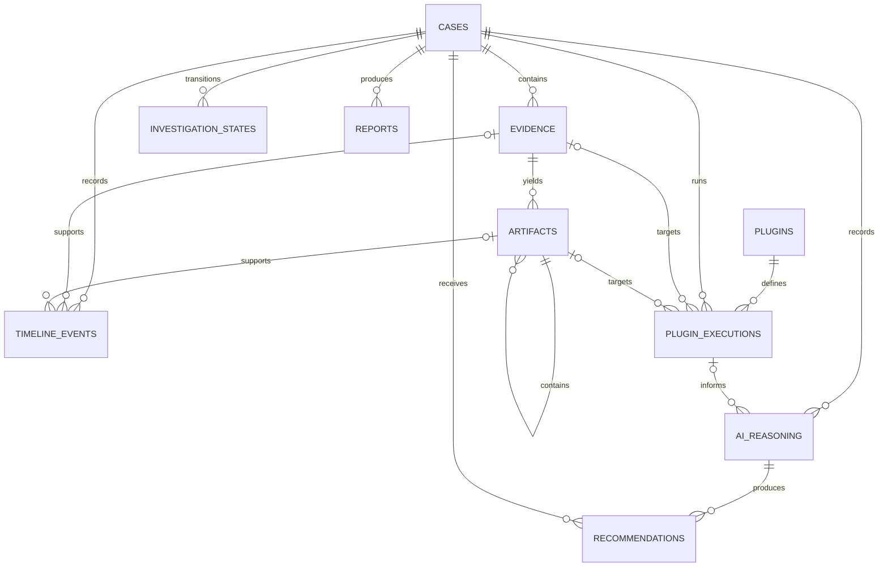

# CyberInvestigator AI database ER diagram

`cases` is the aggregate root. Evidence belongs to exactly one case, and
artifacts belong to exactly one evidence item; this retains provenance without
duplicating case identifiers on artifacts. Timeline events always belong to a
case and can optionally cite the supporting evidence and/or artifact.

`investigation_states` is an append-only state history, rather than a mutable
case status column, preserving the transition audit trail. `plugins` stores a
plugin identity and version once; each `plugin_executions` row references it and
optionally records the evidence or artifact it processed.

AI reasoning belongs to a case and can cite the plugin execution that informed
it. Each recommendation references its originating AI reasoning record, which
makes the recommendation traceable. Reports are versioned per case and report
type. Settings are independent, namespaced atomic key-value records with a
unique namespace/key pair.
